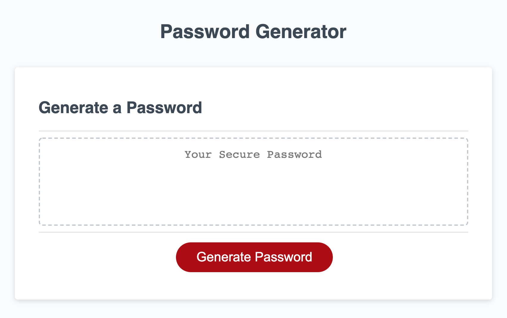

# passwordGenerator

## Description

This project is a password generator. The goal behind this project is to generate a password based off of criteria chosen by the user. The interaction between the user and the application is through the built in browser API's(alert(),confirm(), and prompt().

## Featured functions

- To reduce/ eliminate user error I confined the criteria prompts to a boolean request using confirm().

- By implementing a confirm() based user interaction I have also made the application more user friendly and eliminated the chance of users becoming frustrated by needing to type a specific response to a prompt() function.

## Usage 

The application was published through github and can be accessed via the provided link below.

## Links

[Link to Deployed Website](https://armondr.github.io/passwordGenerator/)

[Link to Code Repository](https://github.com/ArmondR/passwordGenerator)

## Screenshot

## Credits

Contributions to the functinality of this generator goes to the program TA: Bobby Hoffman for assistance in exploring different ways to gather criteria from the user as well as trouble shooting value storage issue. Also help recieved from tutor Michell Brito for assistence in password generation.

### License

______

MIT License

Copyright (c) [2021] [Armond Rodriguez]

Permission is hereby granted, free of charge, to any person obtaining a copy
of this software and associated documentation files (the "Software"), to deal
in the Software without restriction, including without limitation the rights
to use, copy, modify, merge, publish, distribute, sublicense, and/or sell
copies of the Software, and to permit persons to whom the Software is
furnished to do so, subject to the following conditions:

The above copyright notice and this permission notice shall be included in all
copies or substantial portions of the Software.

THE SOFTWARE IS PROVIDED "AS IS", WITHOUT WARRANTY OF ANY KIND, EXPRESS OR
IMPLIED, INCLUDING BUT NOT LIMITED TO THE WARRANTIES OF MERCHANTABILITY,
FITNESS FOR A PARTICULAR PURPOSE AND NONINFRINGEMENT. IN NO EVENT SHALL THE
AUTHORS OR COPYRIGHT HOLDERS BE LIABLE FOR ANY CLAIM, DAMAGES OR OTHER
LIABILITY, WHETHER IN AN ACTION OF CONTRACT, TORT OR OTHERWISE, ARISING FROM,
OUT OF OR IN CONNECTION WITH THE SOFTWARE OR THE USE OR OTHER DEALINGS IN THE
SOFTWARE.

### Badges

____

